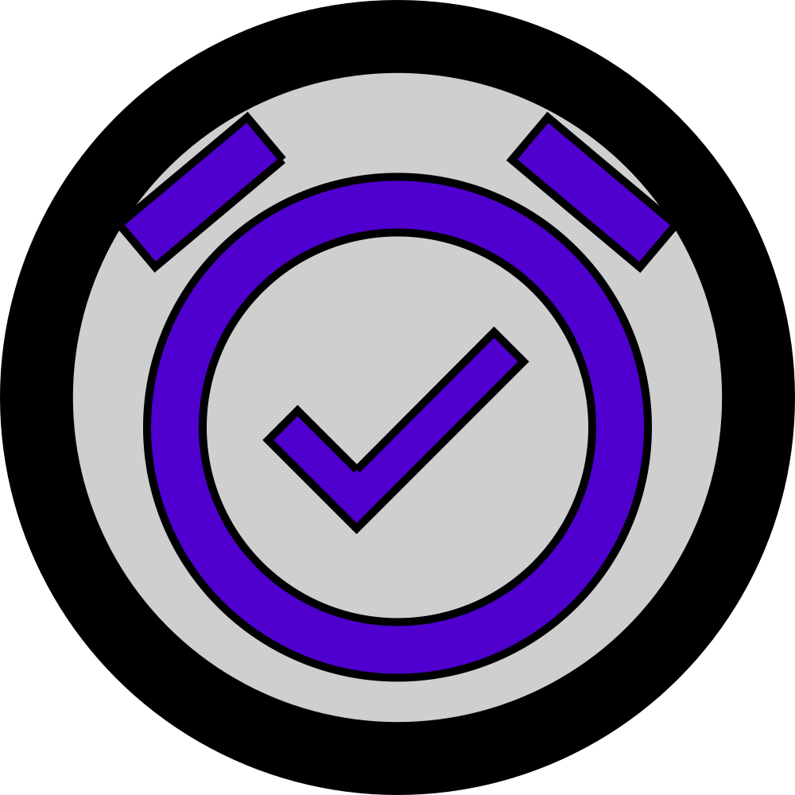

<p align="center">
	
</p>

<h1 align="center">push alarm frontend</h1>

<p align="center">
	The frontend PWA for <a href='https://alarm.mrjackwills.com' target='_blank' rel='noopener noreferrer'>push alarm</a>, powered by <a href='https://www.staticpi.com' target='_blank' rel='noopener noreferrer'>staticPi.com</a>
	<br>
	See the backend Rust source <a href='https://www.github.com/mrjackwills/push_alarm_backend' target='_blank' rel='noopener noreferrer'>here</a>
</p>
<p align="center">
	Built using <a href='https://vuejs.org/' target='_blank' rel='noopener noreferrer'>Vue.js</a> and <a href='https://www.typescriptlang.org/' target='_blank' rel='noopener noreferrer'>Typescript</a>
</p>

<p align="center">
	<ul>
		<li><strong>A+</strong> <a href='https://www.ssllabs.com/ssltest/analyze.html?d=alarm.mrjackwills.com' target='_blank' rel='noopener noreferrer'>ssllabs</a> rating</li>
		<li><strong>A+</strong> <a href='https://securityheaders.com/?q=https%3A%2F%2Falarm.mrjackwills.com&followRedirects=on' target='_blank' rel='noopener noreferrer'>security headers</a> rating</li>
		<li><strong>A+</strong> <a href='https://observatory.mozilla.org/analyze/alarm.mrjackwills.com' target='_blank' rel='noopener noreferrer'>Mozilla observatory</a> rating</li>
	</ul>
</p>

## Required services

1) <a href='https://www.staticpi.com/' target='_blank' rel='noopener noreferrer'>staticPi</a> - the simple and secure messaging service


File that are required by Beluga Snooze
| file | reason |
|---|---|
|```./.env.development```	| development environmental variables|
|```./.env.development```	| productions environmental variables|

### Development
---

```npm run serve```

### Build step
---
```node build``` or ```npm run build```